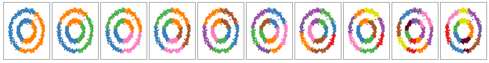
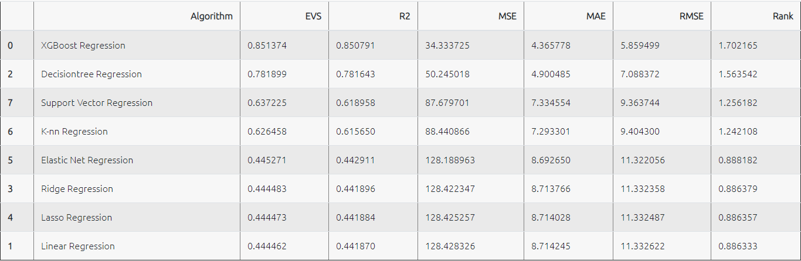
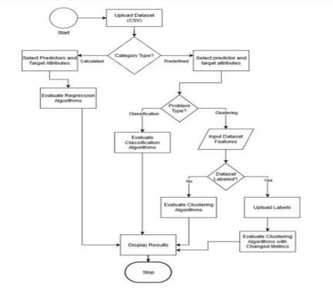

# Web App to Compare and Suggest Machine Learning Algorithm

In the realm of Machine Learning tasks, the critical decision of selecting the most suitable algorithm plays a pivotal role. Traditionally, users might engage in time-consuming experimentation with various algorithms or seek guidance from machine learning experts, a process that may prove impractical in many scenarios. This project addresses these challenges through a web application designed to streamline and expedite the algorithm selection process.

The application, developed with user convenience in mind, significantly reduces the manual analysis required. It incorporates algorithms from three distinct classes of ML problem domains. Upon receiving a user-supplied dataset, the application conducts automated experiments and generates a ranked list of algorithms along with their respective performances.

The user interface is crafted using HTML and CSS, ensuring a seamless and intuitive experience. To power the integration of algorithms, the Flask Framework is employed, adding efficiency and flexibility to the application's functionality. This approach not only accelerates the algorithm selection process but also enhances accessibility, making it a valuable tool for both seasoned practitioners and those new to the field of machine learning.

## Tech Stack

## Demo

https://youtu.be/DIy-OfDKNnc

## Features/Contents

- Dataset Upload and Problem Selection
- Dataset Display and Algorithm Execution
- Regression Algorithms Performance and Results
- Classification Algorithms Performance and Results
- Query Page to proceed with Clustering Problem
- Clustering Algorithms Performance and Results

## Screenshots

 </img>

 </img>

 </img>

## Research Paper 

[International Journal of Engineering Research and Applications Vol. 10, Issue 7, (Series-VI) July 2020,](https://ijera.com/papers/vol10no7/Series-6/E1007062938.pdf)

## Roadmap

- **Enhance Options**: Expand the range of choices by increasing the number of algorithms and parameters. This will provide users with a more comprehensive set of options tailored to their specific needs.

- **Algorithm Optimization**: Consider refining and customizing these parameters to improve algorithm performance and cater to a broader range of datasets.

## Authors

- Navjeet Pattali [@itProjectGroup](https://github.com/itProjectGroup) [@ItProject1920](https://github.com/ItProject1920)
- Ankur Yadav [@AnkurYadav619](https://github.com/AnkurYadav619)
